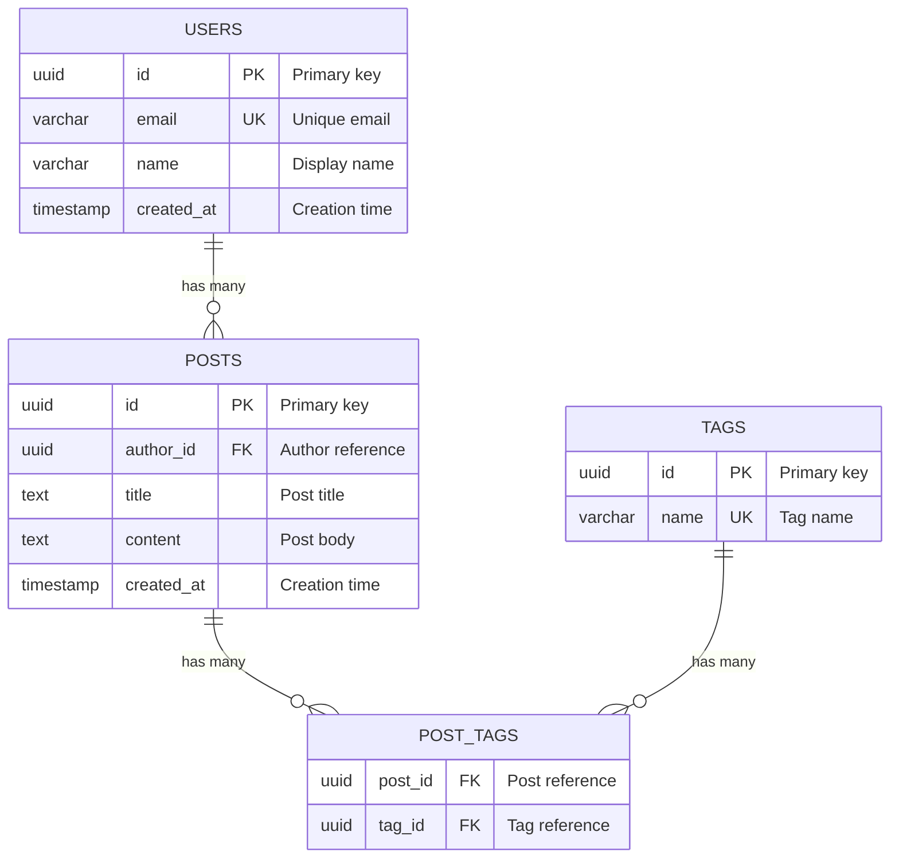

# db-doc: 数据库文档与 ERD 自动生成器

## 触发条件

当用户提到以下关键词时激活：
- "生成数据库文档"、"数据库文档"
- "database docs"、"db docs"
- "generate erd"、"数据库 ERD"
- "表结构文档"、"table documentation"

## 功能概述

自动扫描项目中的数据库 schema 定义（migration 文件、DDL、ORM schema），生成：
1. Mermaid ERD 图（可直接在 GitHub/Markdown 渲染）
2. 每张表的字段文档（Markdown 表格）
3. 表关系说明（一对一、一对多、多对多）
4. 输出到 `docs/database.md`

---

## 第一步：扫描项目，识别数据库 schema 来源

按优先级依次检测，找到即停：

### 1. Prisma

```bash
# 查找 Prisma schema 文件
find . -name "schema.prisma" -not -path "*/node_modules/*"
find . -name "*.prisma" -path "*/prisma/*" -not -path "*/node_modules/*"
```

Schema 位置通常为：`prisma/schema.prisma`

### 2. Drizzle

```bash
# 查找 Drizzle schema 文件
find . -name "schema.ts" -path "*/drizzle/*" -not -path "*/node_modules/*"
find . -name "*.schema.ts" -not -path "*/node_modules/*"
find . -path "*/db/schema/*" -name "*.ts" -not -path "*/node_modules/*"
```

常见位置：`src/db/schema/`、`drizzle/schema.ts`

### 3. TypeORM

```bash
# 查找 TypeORM entity 文件
find . -name "*.entity.ts" -not -path "*/node_modules/*"
find . -path "*/entities/*" -name "*.ts" -not -path "*/node_modules/*"
```

### 4. Supabase Migration

```bash
# 查找 Supabase migration 文件
find . -path "*/supabase/migrations/*" -name "*.sql"
```

### 5. Knex Migration

```bash
# 查找 Knex migration 文件
find . -path "*/migrations/*" -name "*.js" -o -name "*.ts" | grep -v node_modules
```

### 6. Django

```bash
# 查找 Django model 和 migration 文件
find . -name "models.py" -not -path "*/venv/*" -not -path "*/.venv/*"
find . -path "*/migrations/*.py" -not -name "__init__.py" -not -path "*/venv/*"
```

### 7. Alembic (SQLAlchemy)

```bash
# 查找 Alembic migration 文件
find . -path "*/alembic/versions/*.py"
find . -name "models.py" -path "*/models/*" -not -path "*/venv/*"
```

### 8. Go migrate

```bash
# 查找 Go migrate 文件
find . -path "*/migrations/*" -name "*.up.sql"
find . -path "*/migrate/*" -name "*.up.sql"
```

### 9. 纯 SQL DDL

```bash
# 查找独立 SQL 文件
find . -name "*.sql" -not -path "*/node_modules/*" -not -path "*/venv/*" | head -20
```

---

## 第二步：解析 Schema，提取表结构

### 需要提取的信息

对于每张表，提取以下字段信息：

| 属性 | 说明 |
|------|------|
| 字段名 | column name |
| 数据类型 | 原始类型 + 文档友好类型 |
| 是否可空 | NOT NULL / nullable |
| 默认值 | DEFAULT 值 |
| 主键 | PRIMARY KEY |
| 唯一约束 | UNIQUE |
| 外键 | REFERENCES → 目标表.字段 |
| 索引 | INDEX 信息 |
| 描述 | 从注释或命名推断 |

### SQL 类型 → 文档友好类型映射表

| SQL 类型 | 文档类型 | 说明 |
|----------|----------|------|
| `INTEGER`, `INT`, `INT4`, `SERIAL` | Integer | 整数 |
| `BIGINT`, `INT8`, `BIGSERIAL` | BigInt | 大整数 |
| `SMALLINT`, `INT2` | SmallInt | 小整数 |
| `REAL`, `FLOAT4` | Float | 单精度浮点 |
| `DOUBLE PRECISION`, `FLOAT8` | Double | 双精度浮点 |
| `NUMERIC`, `DECIMAL` | Decimal | 精确小数 |
| `BOOLEAN`, `BOOL` | Boolean | 布尔值 |
| `VARCHAR(n)`, `CHARACTER VARYING` | String(n) | 变长字符串 |
| `CHAR(n)` | Char(n) | 定长字符串 |
| `TEXT` | Text | 长文本 |
| `UUID` | UUID | 唯一标识符 |
| `TIMESTAMP`, `TIMESTAMPTZ` | Timestamp | 时间戳 |
| `DATE` | Date | 日期 |
| `TIME`, `TIMETZ` | Time | 时间 |
| `JSONB`, `JSON` | JSON | JSON 数据 |
| `BYTEA`, `BLOB` | Binary | 二进制数据 |
| `ENUM(...)` | Enum | 枚举类型 |
| `ARRAY` | Array | 数组类型 |

### Prisma 类型映射

| Prisma 类型 | 文档类型 |
|-------------|----------|
| `String` | String |
| `Int` | Integer |
| `BigInt` | BigInt |
| `Float` | Float |
| `Decimal` | Decimal |
| `Boolean` | Boolean |
| `DateTime` | Timestamp |
| `Json` | JSON |
| `Bytes` | Binary |

### Drizzle 类型映射

| Drizzle 函数 | 文档类型 |
|--------------|----------|
| `text()` | Text |
| `integer()` | Integer |
| `bigint()` | BigInt |
| `serial()` | Integer (auto) |
| `boolean()` | Boolean |
| `timestamp()` | Timestamp |
| `varchar()` | String |
| `json()` / `jsonb()` | JSON |
| `uuid()` | UUID |
| `real()` | Float |
| `doublePrecision()` | Double |

---

## 第三步：判断表关系

### 关系类型判断规则

#### 一对多 (1:N)

**判断条件**：表 B 有一个外键引用表 A 的主键

```sql
-- 示例：一个 user 有多个 posts
CREATE TABLE posts (
  id SERIAL PRIMARY KEY,
  user_id INTEGER REFERENCES users(id)  -- 外键 → 一对多
);
```

**Prisma 示例**：
```prisma
model Post {
  author   User @relation(fields: [authorId], references: [id])
  authorId Int
}
```

#### 一对一 (1:1)

**判断条件**：外键字段上有 UNIQUE 约束

```sql
-- 示例：一个 user 有一个 profile
CREATE TABLE profiles (
  id SERIAL PRIMARY KEY,
  user_id INTEGER UNIQUE REFERENCES users(id)  -- UNIQUE + 外键 → 一对一
);
```

**Prisma 示例**：
```prisma
model Profile {
  user   User @relation(fields: [userId], references: [id])
  userId Int  @unique
}
```

#### 多对多 (M:N)

**判断条件**：存在联接表（junction table），该表仅包含两个外键（加可选的自身主键和时间戳）

```sql
-- 示例：users 和 roles 多对多
CREATE TABLE user_roles (
  user_id INTEGER REFERENCES users(id),
  role_id INTEGER REFERENCES roles(id),
  PRIMARY KEY (user_id, role_id)  -- 联合主键 + 两个外键 → 多对多
);
```

**识别联接表的特征**：
- 表名通常为 `tableA_tableB` 或 `tableA_to_tableB`
- 仅有两个外键字段（可能加 id、created_at 等辅助字段）
- 两个外键分别指向不同的表

#### 自引用关系

**判断条件**：外键引用同一张表

```sql
CREATE TABLE employees (
  id SERIAL PRIMARY KEY,
  manager_id INTEGER REFERENCES employees(id)  -- 自引用
);
```

---

## 第四步：生成 Mermaid ERD

### Mermaid ERD 语法参考



### Mermaid 关系符号速查

| 符号 | 含义 |
|------|------|
| `\|\|--o{` | 一对多 (one-to-many) |
| `\|\|--\|\|` | 一对一 (one-to-one) |
| `}o--o{` | 多对多 (many-to-many) |
| `\|o--o{` | 零或一对多 |
| `o\|--\|\|` | 零或一对一 |

### 字段标记

| 标记 | 含义 |
|------|------|
| `PK` | Primary Key |
| `FK` | Foreign Key |
| `UK` | Unique Key |

---

## 第五步：生成字段文档

### Markdown 表格模板

对每张表生成如下文档：

```markdown
### `users` 表

用户信息表，存储系统用户的基本资料。

| 字段名 | 类型 | 可空 | 默认值 | 约束 | 描述 |
|--------|------|------|--------|------|------|
| `id` | UUID | NO | `gen_random_uuid()` | PK | 主键 |
| `email` | String(255) | NO | - | UNIQUE | 用户邮箱 |
| `name` | String(100) | YES | `NULL` | - | 显示名称 |
| `role` | Enum(admin,user) | NO | `'user'` | - | 用户角色 |
| `created_at` | Timestamp | NO | `now()` | - | 创建时间 |
| `updated_at` | Timestamp | NO | `now()` | - | 更新时间 |

**索引：**
- `idx_users_email` — UNIQUE on `email`
- `idx_users_created_at` — BTREE on `created_at`
```

### 关系说明模板

```markdown
## 表关系

| 关系 | 类型 | 说明 |
|------|------|------|
| `users` → `posts` | 一对多 | 一个用户可以创建多篇文章 |
| `users` → `profiles` | 一对一 | 一个用户对应一个详细资料 |
| `users` ↔ `roles` | 多对多 | 通过 `user_roles` 联接表关联 |
| `categories` → `categories` | 自引用 | 通过 `parent_id` 实现树形分类 |
```

---

## 第六步：增量更新 vs 全量生成

### 判断逻辑

```
IF docs/database.md 不存在:
    → 全量生成
ELIF docs/database.md 存在:
    → 读取现有文档
    → 解析已有的表列表
    → 对比当前 schema 与文档中的表
    → 仅更新变更部分：
        - 新增的表 → 追加到文档末尾（ERD + 表格）
        - 删除的表 → 从文档中移除（提示用户确认）
        - 修改的表 → 更新对应表的字段文档
        - 新增/删除的关系 → 更新关系表和 ERD
    → 保留用户在文档中手动添加的描述和注释
```

### 增量更新时的注意事项

1. **保留用户自定义内容**：如果用户在表描述或字段描述中手动添加了内容，增量更新时保留这些内容
2. **标记变更**：在更新日志部分记录本次变更
3. **ERD 重新生成**：ERD 图需要完整重新生成（因为 Mermaid 不支持局部更新）
4. **变更摘要**：在文档顶部添加最近一次更新的摘要

### 文档头部模板

```markdown
# Database Documentation

> Auto-generated by db-doc skill. Last updated: YYYY-MM-DD HH:mm

## Change Log

| Date | Changes |
|------|---------|
| 2024-01-15 | Initial generation: 8 tables, 12 relationships |
| 2024-01-20 | Added `notifications` table, updated `users` table |
```

---

## 第七步：输出完整文档

### 文档结构

```markdown
# Database Documentation

> Auto-generated by db-doc skill. Last updated: YYYY-MM-DD HH:mm

## Change Log
...

## Entity Relationship Diagram

​```mermaid
erDiagram
    ...
​```

## Tables

### `table_name` 表
...（每张表的字段文档）

## Relationships

| 关系 | 类型 | 说明 |
...

## Indexes

| 表名 | 索引名 | 类型 | 字段 |
...
```

### 输出位置

- 默认输出到：`docs/database.md`
- 如果 `docs/` 目录不存在，先创建
- 如果文件已存在，按增量更新逻辑处理

---

## 质量检查清单

生成文档后，逐项检查：

- [ ] **完整性**：所有表都已包含在文档中
- [ ] **ERD 语法**：Mermaid ERD 代码语法正确，可以渲染
- [ ] **关系准确**：所有外键关系都已正确标注类型（1:1, 1:N, M:N）
- [ ] **字段完整**：每张表的所有字段都已列出
- [ ] **类型映射**：数据类型已转换为文档友好类型
- [ ] **约束标注**：PK、FK、UNIQUE、NOT NULL 标注正确
- [ ] **默认值**：有默认值的字段已标注
- [ ] **索引记录**：所有索引已记录
- [ ] **联接表识别**：多对多关系的联接表已正确识别
- [ ] **自引用检测**：自引用关系已正确标注
- [ ] **无遗漏外键**：所有 REFERENCES / @relation 都已转换为关系
- [ ] **描述合理**：字段描述从命名推断合理（如 `created_at` → "创建时间"）
- [ ] **变更日志**：如果是增量更新，变更日志已更新
- [ ] **Markdown 格式**：表格对齐，代码块正确闭合

---

## 常见字段名 → 描述推断表

| 字段名模式 | 推断描述 |
|-----------|----------|
| `id` | 主键 |
| `*_id` | 外键引用 |
| `created_at` | 创建时间 |
| `updated_at` | 更新时间 |
| `deleted_at` | 软删除时间 |
| `email` | 邮箱地址 |
| `name` / `title` | 名称/标题 |
| `description` / `desc` | 描述说明 |
| `status` | 状态 |
| `type` / `kind` | 类型/分类 |
| `is_*` / `has_*` | 布尔标记 |
| `count` / `*_count` | 计数 |
| `amount` / `price` / `total` | 金额 |
| `url` / `*_url` | URL 链接 |
| `path` / `*_path` | 文件路径 |
| `avatar` / `image` / `photo` | 图片 |
| `password` / `password_hash` | 密码（哈希） |
| `token` / `*_token` | 令牌 |
| `slug` | URL 友好标识 |
| `sort_order` / `position` | 排序位置 |
| `parent_id` | 父级引用（树形结构） |
| `metadata` / `meta` | 元数据 |
| `config` / `settings` | 配置信息 |
