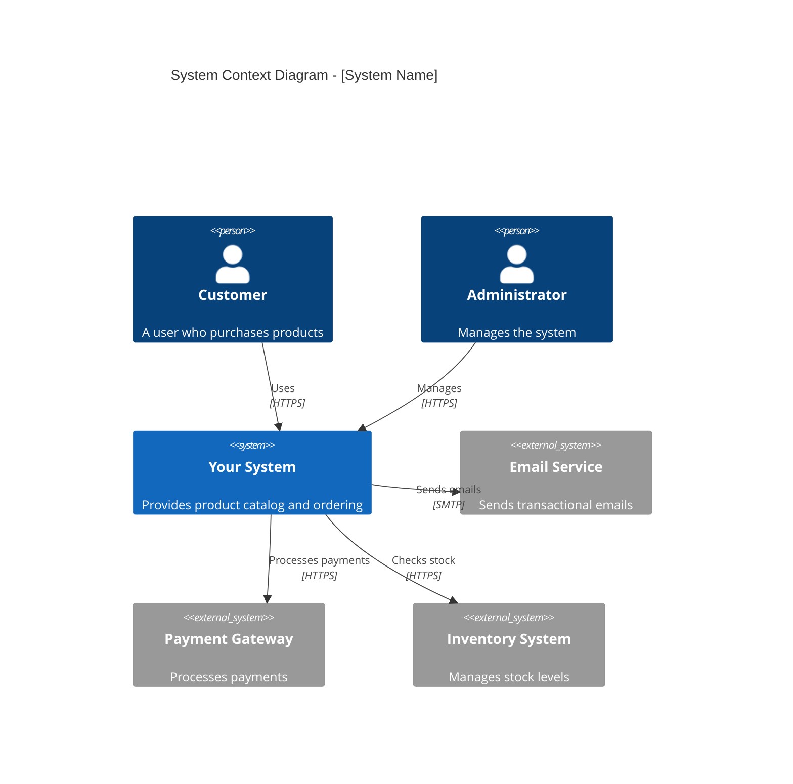
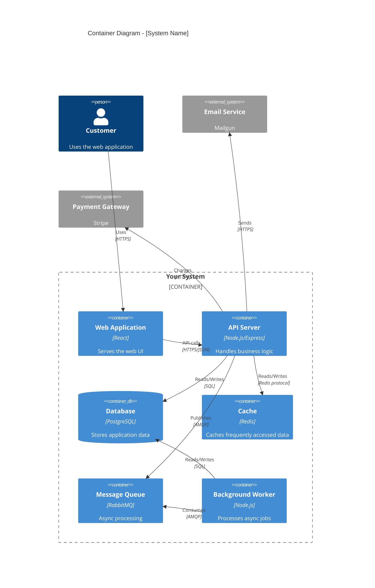
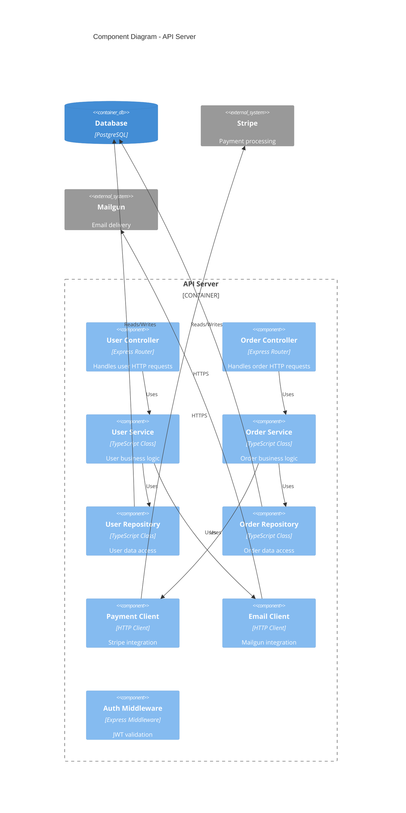

# C4 Diagram Templates

Templates for creating C4 architecture diagrams using ASCII art and Mermaid.
The C4 model provides four levels of abstraction for documenting software architecture.

---

## Level 1: System Context Diagram

Shows your system in the context of users and external systems.

### ASCII Template

```
+================================================================+
|                     SYSTEM CONTEXT DIAGRAM                      |
|                    [System Name] - Level 1                      |
+================================================================+

                           USERS
        +-------------+              +-------------+
        |   Customer  |              |    Admin    |
        |   [Person]  |              |   [Person]  |
        +------+------+              +------+------+
               |                            |
               | Uses                       | Manages
               v                            v
        +------+----------------------------+------+
        |                                          |
        |              YOUR SYSTEM                 |
        |         [Software System]                |
        |                                          |
        |    Provides [key functionality]          |
        |                                          |
        +----+-------------------+------------+----+
             |                   |            |
             | Sends via         | Charges    | Fetches
             v                   v            v
     +-------+-------+   +-------+----+   +--+----------+
     | Email Service |   |  Payment   |   |  External   |
     | [External]    |   |  Gateway   |   |    API      |
     +---------------+   | [External] |   | [External]  |
                         +------------+   +-------------+

LEGEND:
[Person]          = User/Actor
[Software System] = Your system (scope of design)
[External]        = External system not under your control
```

### Mermaid Template



---

## Level 2: Container Diagram

Shows the high-level technical building blocks within your system.

### ASCII Template

```
+================================================================+
|                      CONTAINER DIAGRAM                          |
|                    [System Name] - Level 2                      |
+================================================================+

                           USERS
        +-------------+              +-------------+
        |   Customer  |              |    Admin    |
        +------+------+              +------+------+
               |                            |
               | HTTPS                      | HTTPS
               v                            v
+================================================================+
|                         YOUR SYSTEM                             |
|  +----------------------------------------------------------+  |
|  |                                                          |  |
|  |   +----------------+        +-----------------------+    |  |
|  |   |   Web App      |        |     Admin Portal      |    |  |
|  |   |   [React SPA]  |        |     [React SPA]       |    |  |
|  |   +-------+--------+        +-----------+-----------+    |  |
|  |           |                             |                |  |
|  |           | REST API                    | REST API       |  |
|  |           v                             v                |  |
|  |   +-------+-----------------------------+-------+        |  |
|  |   |                API Server                   |        |  |
|  |   |             [Node.js/Express]               |        |  |
|  |   +-----+------------------+---------------+----+        |  |
|  |         |                  |               |             |  |
|  |         v                  v               v             |  |
|  |   +-----+-----+     +------+------+   +----+----+        |  |
|  |   | Database  |     |    Cache    |   |  Queue  |        |  |
|  |   | [Postgres]|     |   [Redis]   |   |[RabbitMQ]|       |  |
|  |   +-----------+     +-------------+   +---------+        |  |
|  |                                            |             |  |
|  |                                            v             |  |
|  |                                     +------+------+      |  |
|  |                                     |   Worker    |      |  |
|  |                                     | [Node.js]   |      |  |
|  |                                     +-------------+      |  |
|  +----------------------------------------------------------+  |
+================================================================+
             |                    |                |
             v                    v                v
      +------+------+      +------+------+   +-----+------+
      | Email Svc   |      | Payment Svc |   | Analytics  |
      | [External]  |      | [External]  |   | [External] |
      +-------------+      +-------------+   +------------+

LEGEND:
[Technology]  = Container with technology choice
[External]    = External system
```

### Mermaid Template



---

## Level 3: Component Diagram

Shows the internal structure of a container.

### ASCII Template

```
+================================================================+
|                     COMPONENT DIAGRAM                           |
|               API Server Container - Level 3                    |
+================================================================+

+----------------------------------------------------------------+
|                        API SERVER                               |
|                      [Node.js/Express]                          |
|                                                                 |
|  CONTROLLERS (HTTP Interface)                                   |
|  +----------------+  +----------------+  +----------------+     |
|  | UserController |  |OrderController |  |ProductController|    |
|  +-------+--------+  +-------+--------+  +--------+-------+     |
|          |                   |                    |             |
|          v                   v                    v             |
|  SERVICES (Business Logic)                                      |
|  +----------------+  +----------------+  +----------------+     |
|  |  UserService   |  | OrderService   |  |ProductService  |     |
|  +-------+--------+  +-------+--------+  +--------+-------+     |
|          |                   |                    |             |
|          v                   v                    v             |
|  REPOSITORIES (Data Access)                                     |
|  +----------------+  +----------------+  +----------------+     |
|  |UserRepository  |  |OrderRepository |  |ProductRepository|   |
|  +-------+--------+  +-------+--------+  +--------+-------+     |
|          |                   |                    |             |
|          +-------------------+--------------------+             |
|                              |                                  |
|  CLIENTS (External Services)                                    |
|  +----------------+  +----------------+  +----------------+     |
|  | PaymentClient  |  |  EmailClient   |  |InventoryClient |     |
|  +----------------+  +----------------+  +----------------+     |
|                                                                 |
|  CROSS-CUTTING                                                  |
|  +----------------+  +----------------+  +----------------+     |
|  |  AuthMiddleware|  | LoggingMiddleware| |ErrorHandler   |     |
|  +----------------+  +----------------+  +----------------+     |
+----------------------------------------------------------------+
          |                    |                    |
          v                    v                    v
   +------+------+     +-------+-------+    +-------+-------+
   |  Database   |     | Payment API   |    | Email Service |
   | [PostgreSQL]|     |  [External]   |    |  [External]   |
   +-------------+     +---------------+    +---------------+
```

### Mermaid Template



---

## Common Architecture Patterns

### Microservices Architecture

```
+================================================================+
|                  MICROSERVICES ARCHITECTURE                     |
+================================================================+

                    +------------------+
                    |   API Gateway    |
                    |    [Kong/Nginx]  |
                    +--------+---------+
                             |
        +--------------------+--------------------+
        |                    |                    |
        v                    v                    v
+-------+--------+   +-------+--------+   +-------+--------+
|  User Service  |   | Order Service  |   |Product Service |
|   [Node.js]    |   |   [Node.js]    |   |    [Go]        |
+-------+--------+   +-------+--------+   +-------+--------+
        |                    |                    |
        v                    v                    v
+-------+--------+   +-------+--------+   +-------+--------+
|   Users DB     |   |   Orders DB    |   |  Products DB   |
|  [PostgreSQL]  |   |  [PostgreSQL]  |   |   [MongoDB]    |
+----------------+   +----------------+   +----------------+

                    +------------------+
                    |  Message Broker  |
                    |   [RabbitMQ]     |
                    +------------------+
                         |  |  |
        +----------------+  |  +----------------+
        |                   |                   |
        v                   v                   v
+-------+--------+  +-------+--------+  +-------+--------+
| Notification   |  |  Analytics     |  |  Search        |
|    Service     |  |   Service      |  |   Service      |
+----------------+  +----------------+  +----------------+
```

### Event-Driven Architecture

```
+================================================================+
|                  EVENT-DRIVEN ARCHITECTURE                      |
+================================================================+

  PRODUCERS                   EVENT BUS                CONSUMERS
+-----------+             +---------------+          +-----------+
|  Order    |  OrderCreated  |             |  OrderCreated  | Inventory |
|  Service  | ------------>  |             | ------------> | Service   |
+-----------+                |             |               +-----------+
                             |   Kafka /   |
+-----------+  PaymentDone   |  RabbitMQ   |  PaymentDone   +-----------+
|  Payment  | ------------>  |             | ------------> | Notification|
|  Service  |                |             |               | Service    |
+-----------+                |             |               +-----------+
                             |             |
+-----------+  UserCreated   |             |  UserCreated   +-----------+
|   User    | ------------>  |             | ------------> | Analytics  |
|  Service  |                |             |               |  Service   |
+-----------+                +---------------+             +-----------+

Events: { type: "OrderCreated", data: {...}, timestamp, correlationId }
```

### Layered Architecture

```
+================================================================+
|                    LAYERED ARCHITECTURE                         |
+================================================================+

+----------------------------------------------------------------+
|                     PRESENTATION LAYER                          |
|    Controllers, Views, DTOs, View Models, Input Validation      |
+----------------------------+-----------------------------------+
                             |
                             v
+----------------------------------------------------------------+
|                     APPLICATION LAYER                           |
|    Use Cases, Application Services, Command/Query Handlers      |
+----------------------------+-----------------------------------+
                             |
                             v
+----------------------------------------------------------------+
|                       DOMAIN LAYER                              |
|    Entities, Value Objects, Domain Services, Domain Events      |
+----------------------------+-----------------------------------+
                             |
                             v
+----------------------------------------------------------------+
|                   INFRASTRUCTURE LAYER                          |
|    Repositories, External APIs, Database, File System, Email    |
+----------------------------------------------------------------+

DEPENDENCY RULE: Dependencies only point inward (toward domain)
```

---

## Diagram Checklist

When creating architecture diagrams:

### System Context
- [ ] System boundary clearly defined
- [ ] All users/personas identified
- [ ] All external systems shown
- [ ] Relationships labeled with purpose

### Container
- [ ] All containers within system boundary
- [ ] Technology choices indicated
- [ ] Container responsibilities clear
- [ ] Data flows shown with protocols

### Component
- [ ] Components grouped logically
- [ ] Interfaces between components clear
- [ ] External dependencies visible
- [ ] Cross-cutting concerns shown

### General
- [ ] Consistent notation used
- [ ] Legend included if needed
- [ ] Title and context provided
- [ ] Kept simple enough to understand
