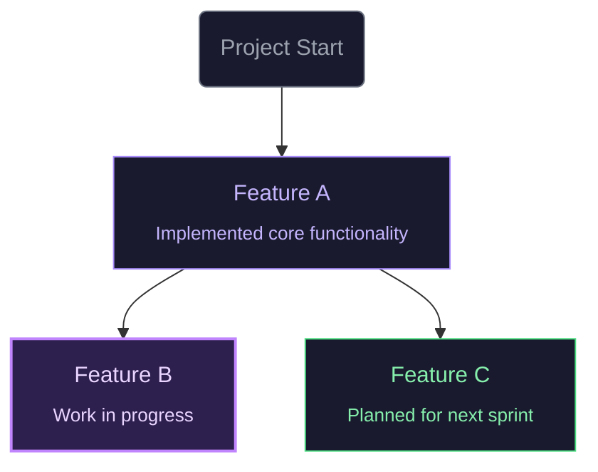

# Viz Vibe Plugin for Claude Code

**Visual context map for vibe coding** - Track your coding trajectory, maintain context across AI sessions, and visualize your project evolution as a graph.

## Features

- 🔄 **Automatic Trajectory Updates**: Hooks automatically read and update `vizvibe.mmd` on session start/stop
- 📊 **Visual Graph**: Your work trajectory rendered as an interactive Mermaid flowchart
- 🎯 **Context Persistence**: Maintain project context across Claude Code sessions
- ⌨️ **Slash Commands**: Quick access to trajectory management

## Installation

### From Marketplace (Recommended)

```bash
/plugin install vizvibe
```

### Local Development

```bash
# Clone the repository
git clone https://github.com/NamHyeongKeol/viz-vibe.git
cd viz-vibe

# Run Claude Code with the plugin
claude --plugin-dir ./vizvibe-plugin
```

## Usage

### Slash Commands

| Command           | Description                                     |
| ----------------- | ----------------------------------------------- |
| `/vizvibe:init`   | Initialize a new trajectory for your project    |
| `/vizvibe:update` | Manually update the trajectory with recent work |
| `/vizvibe:status` | Show current trajectory status                  |

### Automatic Behavior

1. **Session Start**: Plugin reads `vizvibe.mmd` and provides context to Claude
2. **Session Stop**: Plugin prompts Claude to update the trajectory with completed work

### Visualization

For the best experience, install the **Viz Vibe VS Code Extension** to visualize your trajectory as an interactive graph:

- [VS Code Marketplace](https://marketplace.visualstudio.com/items?itemName=vizvibe.vizvibe)

## File Structure

When you initialize Viz Vibe, it creates:

```
your-project/
├── vizvibe.mmd          # Your trajectory graph (Mermaid format)
└── .vizvibe-state.json  # Plugin state (auto-managed, gitignore this)
```

## Example Trajectory



## .gitignore

Add the following to your `.gitignore`:

```
.vizvibe-state.json
```

## License

MIT License - see [LICENSE](LICENSE)

## Links

- [GitHub Repository](https://github.com/NamHyeongKeol/viz-vibe)
- [VS Code Extension](https://marketplace.visualstudio.com/items?itemName=vizvibe.vizvibe)
- [Documentation](https://github.com/NamHyeongKeol/viz-vibe#readme)
