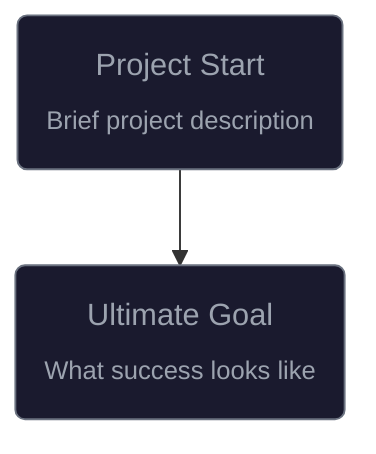

# Initialize Viz Vibe Trajectory

Create an initial `vizvibe.mmd` file for this project.

## Steps:

1. **Check if `vizvibe.mmd` already exists**

   - If yes, inform user and show current trajectory summary
   - If no, continue with initialization

2. **Analyze the project thoroughly:**

   - Read `README.md` for project purpose and goals
   - Run `git log --oneline -n 30` for recent history
   - Examine key directories and files
   - Look for existing TODO lists, issues, or roadmaps

3. **Create `vizvibe.mmd` with this structure:**



4. **Populate the trajectory with:**

   - **Completed work**: Extract milestones from git history as `[closed]` nodes
   - **Future work**: Add known TODOs as `[opened]` nodes
   - **Project goals**: Ultimate goal and current focus
   - **Connections**: Link related nodes (parallel for independent, sequential for dependent)

5. **Wrap the last active node in RECENT subgraph:**

```mermaid
subgraph recent [RECENT]
    last_active_node_id
end
```

6. **Add `.vizvibe-state.json` to `.gitignore`** if not already present

7. **Ask user for feedback:**
   - "Is this trajectory accurate?"
   - "Any missing TODOs or planned features to add?"

Reference the vizvibe skill for detailed formatting instructions.
