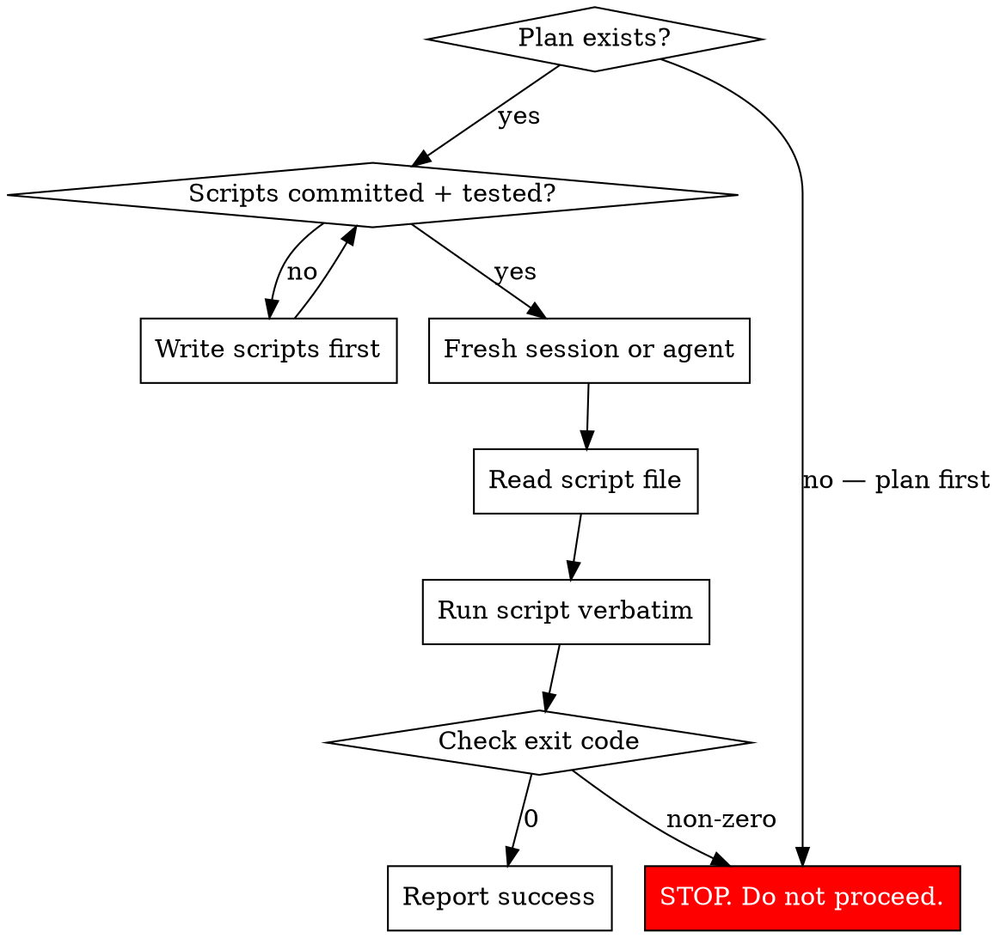

# Production Operations

Execute production operations by running committed, tested scripts — never by improvising from plan knowledge.

## When to Use

Any time you are about to modify a production system: database migration, deploy, env var change, data copy, schema change, infrastructure operation. If it touches prod, use this skill.

## The Rule

**Run the script. Don't reconstruct the script from memory.**

If the script doesn't exist, stop and write one. If the script exists but you're tempted to "just run the equivalent commands inline" — that's the failure pattern this skill prevents.

## Why This Exists

AI agents that plan a complex operation develop deep familiarity with the problem. That familiarity creates false confidence to improvise during execution. In practice:

- The agent "knows" what `copy-to-school.sh` does, so it runs ad-hoc `pg_dump | pg_restore` instead
- The agent sees a verification gate fail and fixes the problem instead of stopping
- The agent reconstructs a command from understanding instead of copy-pasting from the runbook

Everything that uses the tested script works. Everything improvised breaks. This pattern is documented in detail in the companion doc: `context-poisoning-failure-patterns.md`.

## Process



## Hard Rules

### 1. Scripts, not commands

Every production step must be a committed, tested script file. Not a runbook with copy-paste commands. Not inline shell. A file with `set -euo pipefail` that exits on failure.

**Before:**
```
# Step 3: Copy data (from runbook prose)
ssh hetzner 'pg_dump ... | pg_restore ...'
```

**After:**
```bash
# run the committed script
ssh hetzner 'bash /app/scripts/copy-to-school.sh'
```

### 2. Read before running

Before executing any script, `cat` it and read the actual content. Don't rely on your memory of what it does. The script may have been updated since you last saw it.

```bash
cat server/src/scripts/db-unification/copy-to-school.sh
# read it, verify it's what you expect
# THEN run it
```

### 3. Verification gates are hard stops

If a verification step returns non-zero or shows unexpected output:

- **STOP.** Do not proceed to the next step.
- **Report** the unexpected output to the human.
- **Do not** attempt to fix the problem and continue.
- **Do not** reason about why it's "probably fine."

The human decides whether to proceed, not the agent.

### 4. One step per agent

For complex multi-step operations, each step should be a separate agent invocation:

```
Agent 1: "Run build-id-mapping.ts --apply. Report the output."
Agent 2: "Run rekey-campus-fks.ts --apply. Report the output."
Agent 3: "Run copy-to-school.sh. Report the output."
Agent 4: "Run verify-row-counts.sh. If any mismatches, report and STOP."
```

Each agent has minimal context: the script path, what it does in one sentence, and the success criteria. No planning context. No "understanding" of the broader migration. Just run the script and report.

### 5. Back up everything you touch

Before any step that modifies a database or system:

```bash
# Back up EVERY database that will be modified
pg_dump $SOURCE_DB --format=custom -f /tmp/backup-source-$(date +%Y%m%d-%H%M).pgdump
pg_dump $TARGET_DB --format=custom -f /tmp/backup-target-$(date +%Y%m%d-%H%M).pgdump
ls -lh /tmp/backup-*.pgdump
```

If the backup doesn't exist or is 0 bytes, STOP.

### 6. Verify the deploy, not just the migration

After changing env vars or deploying new code:

```bash
# Verify the NEW container has the correct config
docker inspect $CONTAINER --format '{{range .Config.Env}}{{println .}}{{end}}' | grep DATABASE_URL
# Verify it matches what you expect — don't assume
```

### 7. Test the full flow in staging first

The untested part is where it breaks. If the migration scripts were tested but the deploy flow wasn't, the deploy is where the incident happens.

## Anti-Patterns

| Temptation | Reality |
|---|---|
| "I know what this script does, I'll just run the commands inline" | Run the script. |
| "The verification failed but I can see why — let me fix it and continue" | STOP. Report to human. |
| "This is basically the same as what the script does" | Basically the same ≠ the same. Run the script. |
| "I'll optimize by combining steps 3 and 4" | Run them separately. In order. |
| "The env var is set, I'll just restart instead of redeploy" | Verify the new container actually has the env var. |
| "I tested the migration locally, the deploy will be fine" | Test the deploy too. |

## Context Separation

If you planned this operation in a previous conversation or earlier in this conversation:

1. **Do not** rely on your memory of the plan
2. **Read** the committed runbook/script files fresh
3. **If the runbook is prose**, convert it to a script before executing
4. **If you feel confident** enough to skip a step — that's the signal you need the step most

## Rollback

Every operation must have a documented rollback path. Before starting:

- [ ] Backups of ALL modified systems exist and are verified (non-zero size)
- [ ] Rollback commands are written and tested
- [ ] The human knows where the backups are
- [ ] If rollback requires a DB restore, the restore has been tested against a copy
